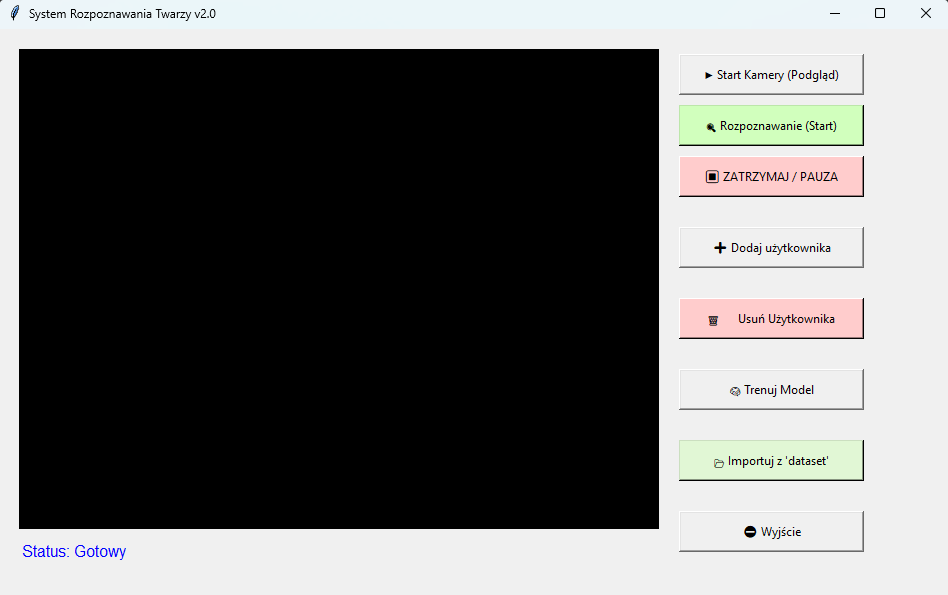
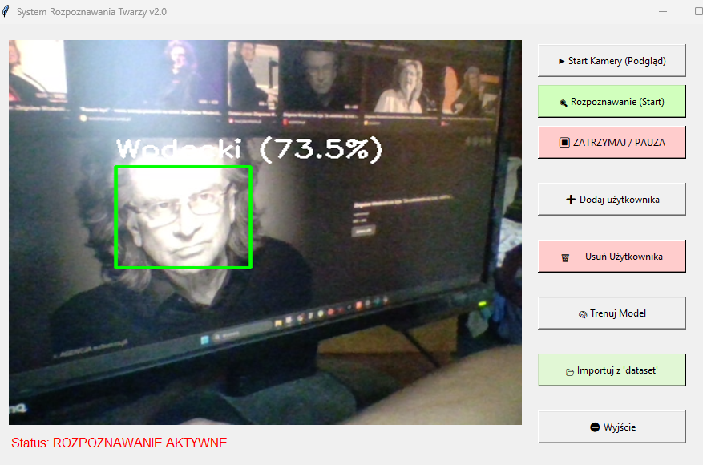
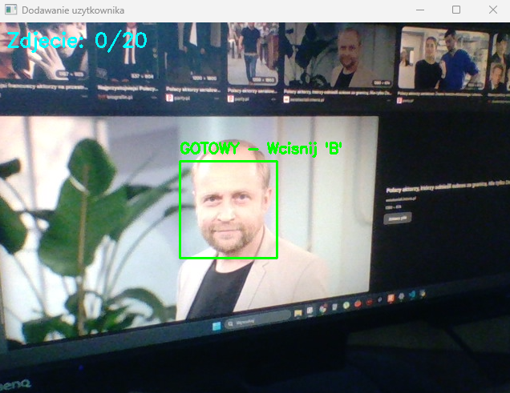

# 📘 Instrukcja Użytkownika
## System Rozpoznawania Twarzy – GUI

# Wprowadzenie
Aplikacja służy do zarządzania bazą tożsamości, zbierania danych biometrycznych (zdjęć twarzy) oraz rozpoznawania osób w czasie rzeczywistym przy użyciu kamery internetowej.

---

## Spis treści
1. Wprowadzenie  
2. Wymagania systemowe  
3. Uruchamianie aplikacji  
4. Interfejs użytkownika  
5. Dodawanie nowego użytkownika  
6. Trenowanie modelu  
7. Tryb rozpoznawania twarzy  
8. Zarządzanie bazą użytkowników  
9. Najczęstsze problemy i rozwiązania  

---

# 1. Wprowadzenie

Aplikacja umożliwia:

- zarządzanie bazą użytkowników,
- zbieranie zdjęć twarzy z kamery,
- trenowanie modelu rozpoznawania twarzy,
- rozpoznawanie osób w czasie rzeczywistym,
- import danych z folderu,
- usuwanie osób z bazy.

Program posiada graficzny interfejs użytkownika (GUI), który znacząco ułatwia obsługę.

---

# 2. Wymagania systemowe

| Element | Wymagania |
|--------|-----------|
| System | Windows 10/11 lub Linux |
| Python | 3.9 – 3.11 |
| RAM | min. 4 GB |
| Kamera | USB lub wbudowana HD |
| GPU | opcjonalnie (przyspiesza działanie) |

---

# 3. Uruchamianie aplikacji

Odpal środowisko wirtualne:

**Windows**
venv\Scripts\Activate.ps1

a nastęnie 
python main.py

Po chwili wyświetli się główne okno programu.

# 4. Interfejs użytkownika

Okno aplikacji składa się z dwóch części:

### 1. Podgląd kamery (po lewej)
- domyślnie nieaktywny,
- w trybie rozpoznawania wyświetla ramki wokół twarzy,
- zielona ramka = osoba znana, czerwona = nieznana.

### 2. Panel przycisków (po prawej)
Zawiera następujące opcje:

| Przycisk | Funkcja |
|----------|---------|
| ➕ Dodaj użytkownika | Zbieranie 20 zdjęć nowej osoby |
| 🧠 Trenuj model | Trenowanie systemu |
| 🔍 Start rozpoznawania | Rozpoznawanie twarzy w czasie rzeczywistym |
| ⏹ Zatrzymaj | Zatrzymanie kamery |
| 🗑 Usuń użytkownika | Usuwanie osoby z bazy |
| 📂 Import z dataset | Import zdjęć z folderu dataset/ |

---

# 5. Dodawanie nowego użytkownika

Aby dodać nową osobę:

1. Kliknij przycisk **"➕ Dodaj użytkownika"**.
2. Wpisz imię lub nazwę użytkownika.
3. Uruchomi się kamera.
4. Ustaw twarz w centralnym obszarze.
5. Naciśnij **klawisz B** na klawiaturze, aby wykonać zdjęcie.
6. Zrób **20 zdjęć**. Aplikacja sama liczy zdjęcia.
7. Po zakończeniu proces zamknie się automatycznie.

### Wskazówki:
- patrz prosto w kamerę,
- delikatnie obracaj głowę,
- zmieniaj mimikę (neutralna, lekki uśmiech, powaga),
- zadbaj o dobre oświetlenie.

---

# 6. Trenowanie modelu

Po dodaniu nowych użytkowników **zawsze** uruchom trening:

1. Kliknij **"🧠 Trenuj Model"**.
2. Wyświetli się pasek postępu.
3. Poczekaj do komunikatu o sukcesie.

Bez treningu model nie będzie znał nowych użytkowników.

---

# 7. Tryb rozpoznawania twarzy

Aby uruchomić tryb rozpoznawania:

1. Kliknij **"🔍 Start rozpoznawania"**.
2. Włączy się kamera.
3. System będzie oznaczał twarze:

- **zielona ramka** → rozpoznana osoba  
- **czerwiona ramka** → osoba nieznana  

4. Aby zatrzymać kamerę, kliknij **"⏹ Zatrzymaj"**.

---

# 8. Zarządzanie bazą użytkowników

### Usuwanie użytkownika

1. Kliknij **"🗑 Usuń użytkownika"**.
2. Wprowadź nazwę (taka sama jak folder w `faces/`).
3. Folder zostanie usunięty.

**Po usunięciu użytkownika koniecznie ponownie trenuj model.**

---

### Import danych z folderu `dataset/`

System pozwala importować gotowe zdjęcia.

Struktura:

dataset/
├── Jan/
│ ├── 1.jpg
│ ├── 2.jpg
├── Anna/
├── a.jpg
├── b.jpg

Aby wykonać import:

1. Umieść foldery w `dataset/`.
2. Kliknij **"📂 Import z dataset"**.
3. System automatycznie:
   - wykryje twarze,
   - wytnie je,
   - zapisze je do `faces/`,
   - przygotuje je do treningu.

---

# 9. Najczęstsze problemy i rozwiązania

### Kamera nie działa
- jest zajęta przez inną aplikację (Teams, Discord, OBS),
- sprawdź dostęp do kamery w ustawieniach prywatności systemu,
- odłącz i podłącz kamerę ponownie.

### Nie rozpoznaje mnie
- dodaj więcej zdjęć (20 to minimum),
- zadbaj o oświetlenie,
- uruchom ponownie **Trenowanie Modelu**.

### Import nie działa
- zdjęcia muszą przedstawiać twarz z przodu,
- unikaj zdjęć grupowych,
- pliki muszą być w formacie .jpg lub .png.

